  

 

## About Me

I'm a **Full Stack Developer & AI Engineer** based in South Korea, with **3+ years of experience** building modern web applications and backend systems.

I enjoy turning ideas into complete products — from designing user-facing experiences and backend architecture to integrating AI capabilities and deploying applications to production.

My current focus is on the intersection of **software engineering and AI**, particularly **AI agents, RAG, LLM-powered applications, and computer vision**.

I care about **clean architecture, maintainable code, thoughtful UX, and building products that solve real problems**.

## Tech Stack

**Frontend**  
React · Next.js · TypeScript · JavaScript · Sass

**Backend**  
Node.js · NestJS · GraphQL · REST API · Apollo

**Database & Infrastructure**  
MongoDB · PostgreSQL · Redis · Docker · Nginx

**AI & Machine Learning**  
Python · PyTorch · RAG · LLMs · Computer Vision · Transfer Learning

## Featured Projects

### Eventra — Premium Event Platform
A full-stack event platform designed for discovering, organizing, and managing events from a single ecosystem.

**Highlights**
- Multi-role system for Users, Organizers, Admins, and Staff
- Event creation, ticketing, seat selection, and QR check-in
- Google & Kakao OAuth authentication
- AI-powered assistant
- Organizer dashboard and event management
- Production deployment with Docker & Nginx

**Stack:** Next.js · TypeScript · NestJS · GraphQL · MongoDB · Docker

🌐 Live: https://eventra.kr

---

### Docora AI — RAG-powered PDF Assistant
An AI-powered document assistant that lets users upload PDFs, ask questions, and receive contextual answers with source references.

**Stack:** Python · Gemini · RAG · Gradio

---

### FoodLens AI — Food Image Classification
A computer vision application that recognizes food images using transfer learning and deep learning.

**Stack:** Python · PyTorch · MobileNetV2 · Torchvision · Gradio

---

### Bingo — Full Stack Web Application
A full-stack application focused on scalable backend architecture, secure media handling, and modern web development.

**Stack:** TypeScript · Node.js · React · Docker

---

### LifeHome — Smart Housing Recommendation
A recommendation platform developed during DIVE 2026 Busan that helps users discover suitable public rental housing based on their preferences.

**Stack:** Next.js · TypeScript · FastAPI · PostgreSQL/PostGIS · Docker

## GitHub Activity

  
  
  

